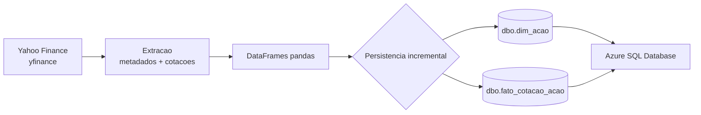

# B3 Lakehouse Project

Pipeline de dados para ingestao incremental de cotacoes de acoes negociadas na B3, com armazenamento analitico no Azure SQL Database.

O projeto combina dados de mercado obtidos via `yfinance` com um modelo dimensional simples, separando o cadastro dos ativos da serie historica de cotacoes. A carga pode ser executada repetidamente sem duplicar registros ja persistidos.

## Visao geral



### Fluxo do pipeline

1. A lista de tickers e lida de `config.py`.
2. O modulo `extractor.py` consulta metadados e historico de precos no Yahoo Finance.
3. Os metadados dos ativos sao inseridos em `dbo.dim_acao` somente quando o ticker ainda nao existe.
4. As cotacoes sao comparadas com os registros existentes por `(ticker, data_referencia)`.
5. Apenas cotacoes novas sao gravadas em `dbo.fato_cotacao_acao`.

## Principais recursos

- Extracao de dados de mercado com `yfinance`.
- Modelo dimensional com dimensao de ativos e tabela fato de cotacoes.
- Carga incremental para evitar duplicidades em execucoes recorrentes.
- Tratamento de falhas por ticker, permitindo que a extracao continue para os demais ativos.
- Conexao parametrizada com Azure SQL Database usando variaveis de ambiente.
- Estrutura pequena e modular, adequada para evoluir para uma rotina agendada ou uma camada de consumo analitico.

## Tecnologias

- Python 3.10+ (o projeto usa anotacoes como `list[str]`).
- `pandas` para transformacao dos dados.
- `yfinance` para consulta ao Yahoo Finance.
- `SQLAlchemy` e `pyodbc` para persistencia em SQL Server.
- Azure SQL Database como destino.

## Estrutura do projeto

```text
b3-lakehouse-project/
├── config.py                 # Configuracoes e lista de tickers
├── database.py               # Conexao e cargas incremental/dimensional
├── extractor.py              # Extracao e normalizacao via yfinance
├── main.py                   # Orquestracao do pipeline
├── requirements.txt          # Dependencias Python fixadas
├── lakehouse_notebooks/      # Espaco para analises e notebooks
├── .env                      # Credenciais locais, nao versionar
└── README.md
```

## Pre-requisitos

- Python 3.10 ou superior.
- Acesso a um Azure SQL Database.
- ODBC Driver 17 for SQL Server instalado na maquina.
- As tabelas `dbo.dim_acao` e `dbo.fato_cotacao_acao` criadas antes da primeira execucao.
- Permissao de leitura e escrita no schema `dbo`.

> O repositorio atualmente nao inclui scripts DDL. O contrato minimo esperado para as tabelas esta descrito abaixo.

## Configuracao

Crie um arquivo `.env` na raiz do projeto. Nunca publique credenciais reais no repositorio.

```env
AZURE_SQL_SERVER=seu-servidor.database.windows.net
AZURE_SQL_DATABASE=nome-do-banco
AZURE_SQL_USER=seu-usuario
AZURE_SQL_PASSWORD=sua-senha
```

Para alterar os ativos monitorados, edite `TICKERS_B3` em `config.py`. Os simbolos devem usar o sufixo `.SA`, no formato aceito pelo Yahoo Finance, por exemplo `PETR4.SA`.

## Contrato das tabelas

### `dbo.dim_acao`

| Coluna | Descricao |
| --- | --- |
| `ticker` | Simbolo do ativo, por exemplo `PETR4.SA` |
| `nome_empresa` | Nome longo ou curto retornado pelo provedor |
| `setor` | Setor da empresa, quando disponivel |
| `industria` | Industria da empresa, quando disponivel |
| `moeda` | Moeda da cotacao, normalmente `BRL` |

### `dbo.fato_cotacao_acao`

| Coluna | Descricao |
| --- | --- |
| `ticker` | Simbolo do ativo |
| `preco_abertura` | Preco de abertura |
| `preco_fechamento` | Preco de fechamento |
| `preco_maximo` | Maior preco do periodo |
| `preco_minimo` | Menor preco do periodo |
| `volume_negociado` | Volume negociado |
| `data_referencia` | Data da cotacao no formato `YYYY-MM-DD` |

Recomenda-se uma chave unica ou indice composto em `fato_cotacao_acao` para `(ticker, data_referencia)`, reforcando no banco a regra de idempotencia usada pela aplicacao.

## Instalacao e execucao

No PowerShell:

```powershell
cd b3-lakehouse-project

python -m venv venv
.\venv\Scripts\Activate.ps1

pip install -r requirements.txt
python main.py
```

Uma execucao bem-sucedida exibe mensagens de inicio, quantidade de registros extraidos, atualizacao da dimensao e conclusao da carga incremental.

## Decisoes de projeto

- **Dimensao e fato separadas:** facilita consultas analiticas e evita repetir metadados da empresa em cada cotacao.
- **Carga incremental:** antes de inserir dados, o pipeline consulta as chaves `(ticker, data_referencia)` ja existentes.
- **Configuracao por ambiente:** credenciais ficam fora do codigo e sao carregadas com `python-dotenv`.
- **Falha isolada por ativo:** um erro ao consultar um ticker e reportado sem interromper automaticamente a tentativa dos demais.

## Limites atuais e proximos passos

- Adicionar scripts de criacao e versionamento do schema SQL.
- Criar testes automatizados para extracao, deduplicacao e persistencia.
- Substituir o tratamento baseado em `print` por logging estruturado e metricas de execucao.
- Agendar a rotina com Airflow, Azure Functions ou outro orquestrador.
- Adicionar uma camada de consumo, como um dashboard de desempenho dos ativos.

## Observacoes

Os dados sao fornecidos pelo Yahoo Finance por meio do `yfinance`. A disponibilidade, granularidade e qualidade dos dados dependem do provedor e das condicoes de mercado. O projeto tem finalidade educacional e de portfolio; valide requisitos de uso e licenciamento antes de utiliza-lo em producao.
